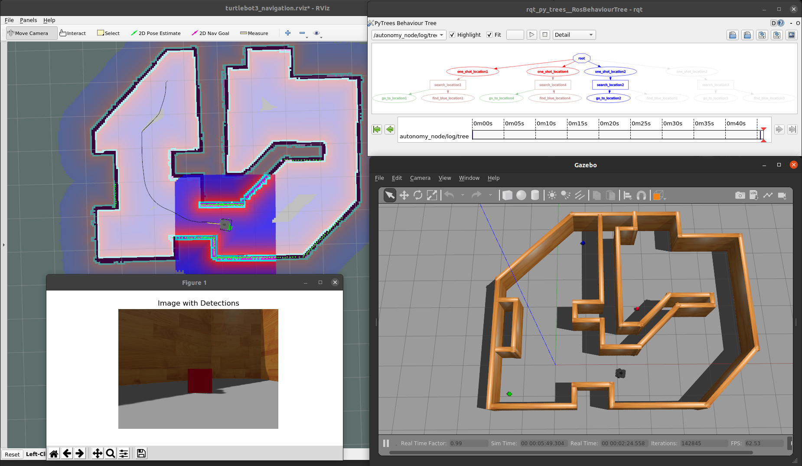
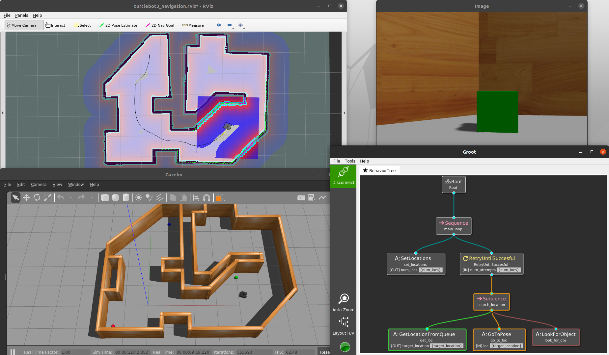

# TurtleBot3 Behavior Demos
In this repository, we demonstrate autonomous behavior with a simulated [ROBOTIS TurtleBot3](https://emanual.robotis.com/docs/en/platform/turtlebot3/overview/#overview) using Ubuntu 22.04 and ROS 2 Humble.

The autonomy in these examples are designed using **behavior trees**.
For more information, refer to [this blog post](https://roboticseabass.com/2021/05/08/introduction-to-behavior-trees/) or the [Behavior Trees in Robotics and AI textbook](https://arxiv.org/abs/1709.00084).

This also serves as an example for Docker workflows in ROS based projects.
For more information, refer to [this blog post](https://roboticseabass.com/2023/07/09/updated-guide-docker-and-ros2/).

If you want to use ROS 1, check out the old version of this example from the [`noetic`](https://github.com/sea-bass/turtlebot3_behavior_demos/tree/noetic) branch of this repository.

By Sebastian Castro, 2021-2024

---

## Setup

### Docker Setup (Recommended)
First, install Docker and Docker Compose using [the official install guide](https://docs.docker.com/engine/install/ubuntu/).

To run Docker containers with NVIDIA GPU support, you can optionally install the [NVIDIA Container Toolkit](https://github.com/NVIDIA/nvidia-docker).


First, clone this repository and go into the top-level folder:

```
git clone https://github.com/sea-bass/turtlebot3_behavior_demos.git
cd turtlebot3_behavior_demos
```

Build the Docker images.
This will take a while and requires approximately 5 GB of disk space.

```
docker compose build
```

### Local Setup

If you do not want to use Docker, you can directly clone this package to a Colcon workspace and build it provided you have the necessary dependencies.
As long as you can run the examples in the [TurtleBot3 manual](https://emanual.robotis.com/docs/en/platform/turtlebot3/overview/#overview), you should be in good shape.

First, make a Colcon workspace and clone this repo there:

```
mkdir -p turtlebot3_ws/src
cd turtlebot3_ws/src
git clone https://github.com/sea-bass/turtlebot3_behavior_demos.git
```

Clone the external dependencies:

```
sudo apt-get install python3-vcstool
vcs import < turtlebot3_behavior_demos/dependencies.repos
```

Set up any additional dependencies using rosdep:

```
sudo apt update && rosdep install -r --from-paths . --ignore-src --rosdistro $ROS_DISTRO -y
```

Ensure you have the necessary Python packages for these examples:

```
pip3 install matplotlib transforms3d
```

Then, build the workspace.

```
cd turtlebot3_ws
colcon build
```

NOTE: For best results, we recommend that you change your ROS Middleware (RMW) implementation to Cyclone DDS by following [these instructions](https://docs.ros.org/en/humble/Installation/DDS-Implementations/Working-with-Eclipse-CycloneDDS.html).

---

## Basic Usage

We use [Docker Compose](https://docs.docker.com/compose/) to automate building, as shown above, but also for various useful entry points into the Docker container once it has been built.
**All `docker compose` commands below should be run from your host machine, and not from inside the container**.

To enter a Terminal in the overlay container:

```
docker compose run overlay bash
```

Once inside the container, you can verify that display in Docker works by starting a basic Gazebo simulation included in the standard TurtleBot3 packages:

```
ros2 launch turtlebot3_gazebo turtlebot3_world.launch.py
```

Alternatively, you can use the pre-existing `sim` service to do this in a single line:

```
docker compose up sim
```

If you want to develop using Docker, you can also launch a dev container using:

```
# Start the dev container
docker compose up dev

# Open as many interactive shells as you want to the container
docker compose exec -it dev bash
```

---

## Behavior Trees Demo

In this example, the robot navigates around known locations with the goal of finding a block of a specified color (red, green, or blue).
Object detection is done using simple thresholding in the [HSV color space](https://en.wikipedia.org/wiki/HSL_and_HSV) with calibrated values.

To start the demo world, run the following command:

```
docker compose up demo-world
```

### Behavior Trees in Python

To start the Python based demo, which uses [`py_trees`](https://py-trees.readthedocs.io/en/devel/):

```
docker compose up demo-behavior-py
```

You can also change the following environment variables to set arguments for the launch files, or by modifying the defaults in the `.env` file:

```
TARGET_COLOR=green BT_TYPE=queue ENABLE_VISION=true docker compose up demo-behavior-py
```

Note that the behavior tree viewer ([`py_trees_ros_viewer`](https://github.com/splintered-reality/py_trees_ros_viewer)) should automatically discover the ROS node containing the behavior tree and visualize it.

After starting the commands above (plus doing some waiting and window rearranging), you should see the following.
The labeled images will appear once the robot reaches a target location.



### Behavior Trees in C++

If you want to use BehaviorTree.CPP and Groot2 for visualization, [download Groot2 from the website](https://www.behaviortree.dev/groot/).
To be consistent with the repository, download the AppImage and save it to your `$HOME` folder.

To start the C++ demo, which uses [`BehaviorTree.CPP`](https://www.behaviortree.dev/):

```
docker compose up demo-behavior-cpp
```

You can also change the following environment variables to set arguments for the launch files, or by modifying the defaults in the `.env` file:

```
TARGET_COLOR=green BT_TYPE=queue ENABLE_VISION=true docker compose up demo-behavior-cpp
```

This example uses the behavior tree viewer ([`Groot2`](https://github.com/BehaviorTree/Groot2)).

After starting the commands above (plus doing some waiting and window rearranging), you should see the following.
The labeled images will appear once the robot reaches a target location.

NOTE: You will need the PRO version of Groot2 to view live behavior tree updates.
If you are a student or involved in academic work, you can get a free license to try this out.
Refer to [the Groot2 website](https://www.behaviortree.dev/groot/) for more information.


